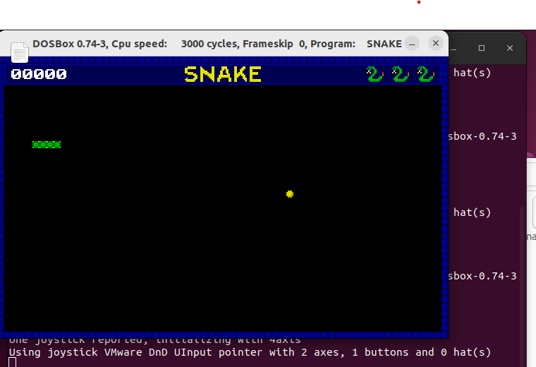
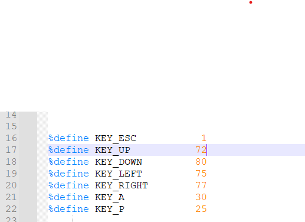

## 项目名称: 贪吃蛇游戏 - Snake Game

### 1. 项目背景

本项目旨在实现一个经典的贪吃蛇游戏，为用户提供一种娱乐方式。通过控制蛇的移动，用户需要尽可能地吃到食物，使蛇的长度不断增加，同时避免蛇头与蛇身或边界相撞。游戏设有得分系统，用户可以挑战自己的最高分，并享受游戏的乐趣。

### 2. 项目功能介绍

#### 2.1 游戏界面

- 采用基本的ASCII字符绘制游戏画面，简洁而富有趣味。

- 显示游戏得分、蛇的长度等信息。

使用 VGA 模式、直接内存访问（DMA）、缓冲区等技术来实现

```assembly
;部分代码

; gfx routines
init13h:
        MOV AX,0013H                                   ; set 320x200 8bit video mode
        INT 10H
        RET


close13h:
        MOV AX,0003H                                   ; restore text mode
        INT 10H
        RET


vsync:                                               ; wait for end of screen updating
        PUSH AX
        PUSH DX
        MOV DX,03DAH
vsync_1:
        IN AL,DX
        TEST AL,0
        JNE vsync_1
        POP DX
        POP AX
        RET


set_palette:
        PUSH AX
        PUSH BX
        PUSH CX
        PUSH DX
        MOV AX,0
        MOV BX,palette                               ; load palette adress to BX
        MOV CX,256                                   ; 256 colors (8bit)
set_palette_1:
        PUSH AX
        MOV DX,03C8H                                 ; set first VGA DAC port
        OUT DX,AL                                    ; send color num (AL) to VGA DAC
        INC DX                                       ; set next port
        MOV AL,[BX]                                  ; send RGB and increment BX pointer
        OUT DX,AL
        INC BX
        MOV AL,[BX]
        OUT DX,AL
        INC BX
        MOV AL,[BX]
        OUT DX,AL
        INC BX
        POP AX
        INC AL                                       ; increment color num
        LOOP set_palette_1
        POP DX
        POP BX
        POP CX
        POP AX
        RET


draw_screen:                                         ; move data from 9000h to A000h segment
        CALL vsync
        PUSH DS
        PUSH ES
        PUSH AX
        PUSH CX
        PUSH DI
        MOV AX,SCR_MEM
        MOV DS,AX
        MOV AX,VGA_MEM
        MOV ES,AX
        MOV CX,64000
draw_screen_1:
        MOV DI,CX
        DEC DI
        MOV AL,[DS:DI]
        MOV [ES:DI],AL
        LOOP draw_screen_1
        POP DI
        POP CX
        POP AX
        POP ES
        POP DS
        RET


clear_screen:                                        ; clear screen buffer, CL - color
        PUSH ES
        PUSH AX
        PUSH DI
        MOV AX,SCR_MEM
        MOV ES,AX
        MOV AL,CL
        MOV CX,64000
clear_screen_1:
        MOV DI,CX
        DEC DI
        MOV [ES:DI],AL
        LOOP clear_screen_1
        POP DI
        POP AX
        POP ES
        RET

```

**Graphics (gfx) Routines:**

- `init13h:` 初始化图形模式（320x200 8位色彩）。
- `close13h:` 关闭图形模式，恢复文本模式。
- `vsync:` 等待垂直同步，确保在屏幕更新完成之前暂停。
- `set_palette:` 设置 VGA 调色板。
- `draw_screen:` 将数据从 9000h 移动到 A000h 段，可能是用于更新屏幕。
- `clear_screen:` 清空屏幕缓冲区。
- `putpixel:` 在指定位置绘制一个像素。
- `getpixel:` 获取指定位置的像素颜色。
- `draw_sprite:` 绘制一个蛇。
- `draw_transparent_sprite:` 绘制一个具有透明色的蛇。
- `hline:` 绘制水平线。
- `vline:` 绘制垂直线。
- `rect:` 绘制矩形。
- `rectfill:` 填充矩形。
- `draw_char_mask:` 根据字符掩码绘制字符。
- `draw_char:` 根据字符的 ASCII 值绘制字符。
- `draw_integer:` 绘制整数。
- `draw_text:` 绘制文本。

界面展示：



```assembly
;部分绘制数据
sprite_logo                                          ; 54x11 - main logo
DB   0,  0,158,158,158,158,158,158,  0,  0,  0,158,  0,  0,  0,  0,  0,  0,  0,158,158,  0,  0,  0,  0,  0,158,158,158,158,  0,  0,  0,  0,  0,158,158,  0,  0,  0,  0,158,158,  0,  0,  0,158,158,158,158,158,158,158,158
DB 158,158,158,158,158,158,158,158,  0,  0,  0,158,158,  0,  0,  0,  0,  0,  0,158,158,  0,  0,  0,  0,  0,158,158,158,158,  0,  0,  0,  0,  0,158,158,  0,  0,  0,158,158,158,  0,  0,  0,158,158,158,158,158,158,158,158
DB 158,158,  0,  0,  0,  0,  0,  0,  0,  0,  0,158,158,158,  0,  0,  0,  0,  0,158,158,  0,  0,  0,  0,  0,158,158,  0,158,158,  0,  0,  0,  0,158,158,  0,  0,158,158,158,  0,  0,  0,  0,158,158,  0,  0,  0,  0,  0,  0
DB 158,158,  0,  0,  0,  0,  0,  0,  0,  0,  0,158,158,158,158,158,  0,  0,  0,158,158,  0,  0,  0,  0,158,158,  0,  0,158,158,  0,  0,  0,  0,158,158,  0,  0,158,158,  0,  0,  0,  0,  0,158,158,  0,  0,  0,  0,  0,  0
DB 158,158,158,158,158,158,  0,  0,  0,  0,  0,158,158,158,158,158,158,  0,  0,158,158,  0,  0,  0,  0,158,158,  0,  0,158,158,  0,  0,  0,  0,158,158,  0,158,158,158,  0,  0,  0,  0,  0,158,158,158,158,158,158,  0,  0
DB   0,  0,158,158,158,158,158,158,  0,  0,  0,158,158,  0,158,158,158,158,158,158,158,  0,  0,  0,  0,158,158,  0,  0,  0,158,158,  0,  0,  0,158,158,158,158,158,158,158,  0,  0,  0,  0,158,158,158,158,158,158,  0,  0
DB   0,  0,  0,  0,  0,  0,158,158,158,  0,  0,158,158,  0,  0,  0,158,158,158,158,158,  0,  0,  0,158,158,158,158,158,158,158,158,  0,  0,  0,158,158,158,158,  0,158,158,158,  0,  0,  0,158,158,  0,  0,  0,  0,  0,  0
DB   0,  0,  0,  0,  0,  0,  0,158,158,  0,  0,158,158,  0,  0,  0,  0,158,158,158,158,  0,  0,  0,158,158,158,158,158,158,158,158,  0,  0,  0,158,158,158,  0,  0,  0,158,158,  0,  0,  0,158,158,  0,  0,  0,  0,  0,  0
DB   0,158,  0,  0,  0,  0,158,158,158,  0,  0,158,158,  0,  0,  0,  0,  0,158,158,158,  0,  0,158,158,158,  0,  0,  0,  0,  0,158,158,  0,  0,158,158,  0,  0,  0,  0,158,158,158,  0,  0,158,158,  0,  0,  0,  0,  0,  0
DB 158,158,158,158,158,158,158,158,  0,  0,  0,158,158,  0,  0,  0,  0,  0,  0,158,158,  0,  0,158,158,  0,  0,  0,  0,  0,  0,158,158,  0,  0,158,158,  0,  0,  0,  0,  0,158,158,  0,  0,158,158,158,158,158,158,158,158
DB   0,158,158,158,158,158,158,  0,  0,  0,  0,158,158,  0,  0,  0,  0,  0,  0,  0,158,  0,  0,158,158,  0,  0,  0,  0,  0,  0,158,158,  0,  0,158,158,  0,  0,  0,  0,  0,  0,158,  0,  0,158,158,158,158,158,158,158,158


sprite_frame_box                                     ; 5x5 - main frame box
DB  48, 48, 48, 48, 48
DB  48, 53, 53, 53, 41
DB  48, 53, 43, 53, 41
DB  48, 53, 53, 53, 41
DB  41, 41, 41, 41, 41


sprite_snakes_food                                   ; 5x5 - snakes food :)
DB   0,155,155,155,  0
DB 155,157,157,157,151
DB 155,157,161,154,151
DB 155,157,154,154,151
DB   0,151,151,151,  0


sprite_snake                                         ; 5x5 - snakes body
DB  97, 76, 83, 76, 97
DB  76, 88, 88, 88, 76
DB  83, 88, 88, 88, 83
DB  76, 88, 88, 88, 76
DB  97, 76, 83, 76, 97


sprite_snake_live_1                                  ; 13x11 - live set
DB   0,  0, 85, 85, 85, 90,  0,  0,  0,  0,  0,  0,  0
DB   0, 85, 64, 85, 64, 85, 90,  0,  0,  0,  0,  0,  0
DB   0,  0, 85, 85,  0,  0, 85, 90,  0,  0,  0,  0,  0
DB   0,  0,161,  0,  0,  0, 85, 90,  0,  0,  0,  0,  0
DB   0,157,  0,157,  0,  0, 85, 90,  0,  0,  0,  0,129
DB   0,  0,  0,  0,  0, 85, 90,  0,  0,  0,  0,  0,146
DB   0,  0,  0,  0, 85, 90,  0,  0,  0,  0,  0,  0,146
DB   0,  0,  0, 85, 90,  0,  0,  0,  0,  0, 90, 90,  0
DB   0,  0, 85, 90, 90,  0,  0,  0,  0, 90, 85, 85,  0
DB   0,  0, 85, 90, 90, 90, 90, 90, 90, 85, 85,  0,  0
DB   0,  0,  0, 85, 85, 85, 85, 85, 85, 85,  0,  0,  0


sprite_snake_live_0                                  ; 13x11 - live reset
DB   0,  0, 16, 16, 16, 23,  0,  0,  0,  0,  0,  0,  0
DB   0, 16, 30, 16, 30, 16, 23,  0,  0,  0,  0,  0,  0
DB   0,  0, 16, 16,  0,  0, 16, 23,  0,  0,  0,  0,  0
DB   0,  0, 21,  0,  0,  0, 16, 23,  0,  0,  0,  0,  0
DB   0, 21,  0, 21,  0,  0, 16, 23,  0,  0,  0,  0, 30
DB   0,  0,  0,  0,  0, 16, 23,  0,  0,  0,  0,  0, 11
DB   0,  0,  0,  0, 16, 23,  0,  0,  0,  0,  0,  0, 11
DB   0,  0,  0, 16, 23,  0,  0,  0,  0,  0, 23, 23,  0
DB   0,  0, 16, 23, 23,  0,  0,  0,  0, 23, 16, 16,  0
DB   0,  0, 16, 23, 23, 23, 23, 23, 23, 16, 16,  0,  0
DB   0,  0,  0, 16, 16, 16, 16, 16, 16, 16,  0,  0,  0


palette                                              ; game palette
DB   0,  0,  0
DB   0,  0,  0
DB   2,  2,  2
DB   4,  4,  4
DB   6,  6,  6
DB   8,  8,  8
DB  10, 10, 10
DB  12, 12, 12
DB  14, 14, 14
DB  16, 16, 16
DB  18, 18, 18
DB  20, 20, 20
DB  22, 22, 22
DB  24, 24, 24
DB  26, 26, 26
DB  28, 28, 28
DB  30, 30, 30
DB  32, 32, 32
DB  34, 34, 34
DB  36, 36, 36
DB  38, 38, 38
DB  40, 40, 40
DB  42, 42, 42
DB  44, 44, 44
DB  46, 46, 46
DB  48, 48, 48
DB  50, 50, 50
DB  52, 52, 52
DB  54, 54, 54
DB  56, 56, 56
DB  58, 58, 58
DB  60, 60, 60
DB  62, 62, 62
DB   0,  0,  0
DB   0,  0,  2
DB   0,  0,  4
DB   0,  0,  6
DB   0,  0,  8
DB   0,  0, 10
DB   0,  0, 12
DB   0,  0, 14
DB   0,  0, 16
DB   0,  0, 18
DB   0,  0, 20
DB   0,  0, 22
DB   0,  0, 24
DB   0,  0, 26
DB   0,  0, 28
DB   0,  0, 30
DB   0,  0, 32
DB   0,  0, 34
DB   0,  0, 36
DB   0,  0, 38
DB   0,  0, 40
DB   0,  0, 42
DB   0,  0, 44
DB   0,  0, 46
DB   0,  0, 48
DB   0,  0, 50
DB   0,  0, 52
DB   0,  0, 54
DB   0,  0, 56
```

1. `sprite_logo`:
   - 54x11 的主要标志，使用数字表示每个像素的颜色。
   - 0 表示黑色，158 表示另一种颜色。
2. `sprite_frame_box`:
   - 5x5 的主框架，可能用于界面的边框绘制。
   - 48 表示一种颜色，53 表示另一种颜色，41 表示另一种颜色。
3. `sprite_snakes_food`:
   - 5x5 的蛇食物，可能是游戏中蛇的食物。
   - 0 表示背景颜色，155 表示一种颜色，157 表示另一种颜色，151 表示另一种颜色。
4. `sprite_snake`:
   - 5x5 的蛇身体，可能是游戏中蛇的身体部分。
   - 使用 ASCII 码表示颜色。
5. `sprite_snake_live_1`:
   - 13x11 的活动状态（可能是蛇的一部分）。
   - 0 表示背景颜色，90 表示一种颜色，161 表示另一种颜色，157 表示另一种颜色。
6. `sprite_snake_live_0`:
   - 13x11 的非活动状态（可能是蛇的一部分）。
   - 0 表示背景颜色，23 表示一种颜色，30 表示另一种颜色，11 表示另一种颜色。
7. `palette`:
   - 游戏的调色板，定义了一系列 RGB 颜色。每个颜色由三个字节表示。

#### 2.2 游戏操作

- 支持基本的上、下、左、右四个方向的操作，通过键盘进行控制。(控制键为数字8，2，4，6)
- 提供游戏暂停功能，用户可以随时暂停游戏。（p暂停，再次按p继续）



键盘控制部分

```assembly

; keyboard routines
keyboard_int:
        STI
        PUSH AX
        IN AL,60H                                    ; get key from keyboard port
        MOV [CS:lastkey],AL
        POP AX

        PUSH AX
        PUSH CX
        MOV AX,0
        MOV AL,[CS:lastkey]
        CMP AL,128                                   ; check keyboard data (pressed or not)
        JNAE check_keys_1
        SUB AL,128
        MOV CL,0
        JMP check_keys_2
check_keys_1:
        MOV CL,1
check_keys_2:
        MOV BX,key
        ADD BX,AX
        MOV [CS:BX],CL
        POP CX
        POP AX

        PUSH AX
        MOV AL,20H                                   ; send end of irq
        OUT 20H,AL
        POP AX

        CLI
        IRET

install_keyboard:
        MOV AX,3509H                                 ; get old keyboard int proc
        INT 21H
        MOV [CS:old_keyboard_int],BX
        MOV [CS:old_keyboard_int + 2],ES
        MOV AX,2509H                                 ; set new keyboard int proc
        MOV DX,keyboard_int
        PUSH DS
        PUSH CS
        POP DS
        INT 21H
        POP DS
        RET

remove_keyboard:
        MOV AX,2509H                                 ; restore old keyboard proc
        LDS DX,[CS:old_keyboard_int]
        INT 21H
        RET


wait_for_any_key:
        MOV BYTE [lastkey],0
        MOV DL,[lastkey]
wait_for_any_key_1:
        CMP DL,[lastkey]
        JE wait_for_any_key
        RET
;-------

```

1. `keyboard_int` 过程：
   - 开始时通过 `STI` 指令开启中断，表示允许中断处理程序响应其他中断。
   - 使用 `IN` 指令从键盘端口 `60H` 读取键盘输入的扫描码，并将其保存在内存中 `[CS:lastkey]` 处。
   - 判断扫描码的最高位，如果最高位为1，说明是按键释放，将最高位清零，并设置 `CL` 寄存器为1；否则，最高位为0，说明是按键按下，`CL` 寄存器被设置为0。
   - 将键盘扫描码对应的键状态（按下或释放）保存在 `key` 数组中，数组索引为键盘扫描码。
2. `install_keyboard` 过程：
   - 获取旧的键盘中断处理程序地址，保存在 `[CS:old_keyboard_int]` 处。
   - 设置新的键盘中断处理程序，使用 `INT 21H` 中断调用，其中 `DX` 寄存器指向新的中断处理程序 `keyboard_int`。
   - 中断处理程序安装完成后，返回。
3. `remove_keyboard` 过程：
   - 恢复旧的键盘中断处理程序，使用 `INT 21H` 中断调用。
4. `wait_for_any_key` 过程：
   - 通过 `MOV BYTE [lastkey],0` 将 `[lastkey]` 处的值初始化为0。
   - 进入循环 `wait_for_any_key_1`，通过比较 `[lastkey]` 和 `DL` 的值，判断是否有新的键盘输入。如果相等，则继续等待；否则，返回。

#### 2.3 游戏逻辑

- 蛇每次移动，判断是否吃到食物，若吃到则长度增加，同时生成新的食物。
- 判断蛇头是否与蛇身或边界相撞，若是则游戏结束。


- 游戏使用 `int 13h` 中断来进行图形模式的初始化和屏幕绘制。
- 通过 `int 16h` 中断安装键盘中断处理程序，以便检测玩家的按键输入。
- 通过自定义的定时器中断来实现游戏的更新和控制。
- 游戏的更新频率由中断计数器 `timer_counter` 决定，每次中断发生时，该计数器会递增。当计数器达到18时，即每隔18次中断，就会触发一次游戏的更新。

```assembly
timer_int:
    STI
    MOV BYTE [CS:can_update],1                   ; update game
    INC BYTE [CS:timer_counter]
    CMP BYTE [CS:timer_counter],18
    JE timer_int_reset_delay
    JMP timer_int_end
timer_int_reset_delay:
    MOV BYTE [CS:timer_delay],0
    MOV BYTE [CS:timer_counter],0
timer_int_end:
    CLI
    IRET

```


```assembly


; program code
random_init:
        PUSH AX
        PUSH CX
        PUSH DX
        MOV AH,2CH
        INT 21H
        MOV [random_seed],DX
        POP DX
        POP CX
        POP AX
        RET


random_gen:                                          ; return: CL - random byte
        MOV CX,[random_seed]
        IMUL CX,13A7H
        INC CX
        MOV [random_seed],CX
        MOV CL,CH
        MOV CH,0
        RET


random:                                              ; AL - max random number
        CALL random_gen
        CMP CL,AL
        JAE random
        RET


random_seed                            DW 0          ; seed


delay:                                               ; AX - hund. seconds (1/100 s)
        MOV BYTE [timer_delay],1
delay_1:
        CMP BYTE [timer_delay],0
        JNE delay_1
        RET


sound_on:
        PUSH AX
        MOV AL,0B6H
        OUT 43H,AL
        MOV AX,11930
        OUT 42H,AL
        MOV AL,AH
        OUT 42H,AL
        IN AL,61H
        OR AL,3
        OUT 61H,AL
        POP AX
        RET


sound_off:
        PUSH AX
        IN AL,61H
        AND AL,252
        OUT 61H,AL
        POP AX
        RET


move_snake:
        PUSH AX
        PUSH BX
        PUSH CX
        PUSH DX
        CMP BYTE [snake_vector],0
        JE move_snake_end
        MOV CX,[snake_len]
        DEC CX
move_snake_1:
        PUSH CX
        DEC CX
        MOV BX,snake
        MOV AX,CX
        MOV CX,4
        MUL CX
        ADD BX,AX
        MOV AX,[BX]
        MOV CX,[BX + 2]
        MOV [BX + 4],AX
        MOV [BX + 6],CX
        POP CX
        LOOP move_snake_1
        CMP BYTE [snake_vector],1
        JE move_snake_up
        CMP BYTE [snake_vector],2
        JE move_snake_down
        CMP BYTE [snake_vector],3
        JE move_snake_left
        CMP BYTE [snake_vector],4
        JE move_snake_right
move_snake_up:
        SUB WORD [snake + 2],5
        JMP move_snake_vector_end
move_snake_down:
        ADD WORD [snake + 2],5
        JMP move_snake_vector_end
move_snake_left:
        SUB WORD [snake],5
        JMP move_snake_vector_end
move_snake_right:
        ADD WORD [snake],5
        JMP move_snake_vector_end
move_snake_vector_end:
move_snake_end:
        POP DX
        POP CX
        POP BX
        POP AX
        RET


set_snakes_vector:
        PUSH AX

        CMP AL,1
        JE set_snakes_vector_up
        CMP AL,2
        JE set_snakes_vector_down
        CMP AL,3
        JE set_snakes_vector_left
        CMP AL,4
        JE set_snakes_vector_right
        JMP set_snakes_vector_end

set_snakes_vector_up:
        CMP BYTE [snake_vector],2                    ; if not down
        JE set_snakes_vector_up_1
        MOV BYTE [snake_vector],1                    ; set up
set_snakes_vector_up_1:
        JMP set_snakes_vector_end

set_snakes_vector_down:
        CMP BYTE [snake_vector],1                    ; if not up
        JE set_snakes_vector_down_1
        MOV BYTE [snake_vector],2                    ; set down
set_snakes_vector_down_1:
        JMP set_snakes_vector_end

set_snakes_vector_left:
        CMP BYTE [snake_vector],4                    ; if not right
        JE set_snakes_vector_left_1
        CMP BYTE [snake_vector],0                    ; if not 'no move'
        JE set_snakes_vector_left_1
        MOV BYTE [snake_vector],3                    ; set left
set_snakes_vector_left_1:
        JMP set_snakes_vector_end

set_snakes_vector_right:
        CMP BYTE [snake_vector],3                    ; if not left
        JE set_snakes_vector_right_1
        MOV BYTE [snake_vector],4                    ; set right
set_snakes_vector_right_1:
        JMP set_snakes_vector_end

set_snakes_vector_end:
        POP AX
        RET


reset_snake:
        MOV WORD [snake + 14],60
        MOV WORD [snake + 12],25
        MOV WORD [snake + 10],60
        MOV WORD [snake + 8],30
        MOV WORD [snake + 6],60
        MOV WORD [snake + 4],35
        MOV WORD [snake + 2],60
        MOV WORD [snake],40
        MOV WORD [snake_len],4
        MOV BYTE [snake_vector],0
        RET


reset_food:
        PUSH AX
        PUSH BX
        PUSH CX
; random food x
        MOV AL,58                                    ; max area width / 5
        CALL random
        MOV AH,0
        MOV AL,CL
        MOV BX,5
        MUL BX
        ADD AX,5
        MOV [snakes_food_x],AX
; random food y
        MOV AL,35                                    ; max area height / 5
        CALL random
        MOV AH,0
        MOV AL,CL
        MOV BX,5
        MUL BX
        ADD AX,20
        MOV [snakes_food_y],AX
        POP CX
        POP BX
        POP AX
        RET


increase_snake:                                      ; snake++ :), new head = food position
        PUSH AX
        PUSH BX
        PUSH CX
        PUSH DX
        MOV CX,[snake_len]
increase_snake_1:
        PUSH CX
        DEC CX
        MOV BX,snake
        MOV AX,CX
        MOV CX,4
        MUL CX
        ADD BX,AX
        MOV AX,[BX]
        MOV CX,[BX + 2]
        MOV [BX + 4],AX
        MOV [BX + 6],CX
        POP CX
        LOOP increase_snake_1
        MOV AX,[snakes_food_x]
        MOV [snake],AX
        MOV AX,[snakes_food_y]
        MOV [snake + 2],AX
        INC WORD [snake_len]
        MOV AX,[snake_len]
        CMP AX,[snake_max_len]                       ; if snake_len == snake_max_len then print winner msg and quit
        JE increase_snake_max_len
        JMP increase_snake_end
increase_snake_max_len:
        CALL winner
increase_snake_end:
        POP DX
        POP CX
        POP BX
        POP AX
        RET


detect_collisions:                                   ; detect collisions beetwen objects
        PUSH AX
        PUSH BX
        PUSH CX
        PUSH DX
; detect head and food collision
        MOV AX,[snakes_food_x]
        CMP AX,[snake]                               ; compare food x with head x
        JNE detect_collisions_1
        MOV AX,[snakes_food_y]
        CMP AX,[snake + 2]                           ; compare food y with head y
        JNE detect_collisions_1
; add points and increase snake
        ADD WORD [score],10                          ; add 10 points :)
        CALL increase_snake
        CALL reset_food
detect_collisions_1:
; detect collision with border and decrase lives
        CMP WORD [snake],0                           ; coll. with left border
        JE detect_collisions_dead
        CMP WORD [snake],320 - 5                     ; coll. with right border
        JE detect_collisions_dead
        CMP WORD [snake + 2],15                      ; coll. with top border
        JE detect_collisions_dead
        CMP WORD [snake + 2],200 - 5                 ; coll. with bottom border
        JE detect_collisions_dead
; detect head collision with body
        MOV BX,snake
        ADD BX,8                                     ; jump to next x&y
        MOV AX,[snake]
        MOV DX,[snake + 2]
        MOV CX,[snake_len]
        DEC CX
detect_collisions_head_with_body:
        CMP AX,[BX]
        JNE detect_collisions_head_with_body_next
        CMP DX,[BX + 2]
        JE detect_collisions_dead
detect_collisions_head_with_body_next:
        ADD BX,4
        LOOP detect_collisions_head_with_body
; if everything is ok the jump to the end
        JMP detect_collisions_end
detect_collisions_dead:
        CALL reset_snake
        CALL reset_food
        DEC BYTE [live_counter]
        MOV AX,1000
        CALL draw_screen
        CALL sound_on
        CALL delay
        CALL sound_off
detect_collisions_end:
        POP DX
        POP CX
        POP BX
        POP AX
        RET


main:
        CALL init13h
        CALL install_keyboard
        CALL install_timer
        CALL set_palette
        CALL random_init
; setup snake
        CALL reset_snake
        CALL reset_food
game_loop:
; synchronize game
        CMP BYTE [can_update],1
        JNE game_loop
        MOV BYTE [can_update],0
; clear screen buffer
        MOV CL,0
        CALL clear_screen
; draw frame
        MOV BX,sprite_frame_box
        MOV WORD [SW],5
        MOV WORD [SH],5
; draw top frame
        MOV WORD [SX],0
        MOV WORD [SY],0
        MOV CX,320 / 5
draw_frame_top:
        CALL draw_sprite
        ADD WORD [SX],5
        LOOP draw_frame_top
; draw bottom frame
        MOV WORD [SX],0
        MOV WORD [SY],200 - 5
        MOV CX,320 / 5
draw_frame_bottom:
        CALL draw_sprite
        ADD WORD [SX],5
        LOOP draw_frame_bottom
; draw left frame
        MOV WORD [SX],0
        MOV WORD [SY],0
        MOV CX,200 / 5
draw_frame_left:
        CALL draw_sprite
        ADD WORD [SY],5
        LOOP draw_frame_left
; draw_frame_right
        MOV WORD [SX],320 - 5
        MOV WORD [SY],0
        MOV CX,200 / 5
draw_frame_right:
        CALL draw_sprite
        ADD WORD [SY],5
        LOOP draw_frame_right
; draw top bar
        MOV WORD [PX1],5
        MOV WORD [PY1],5
        MOV WORD [PX2],320 - 5 - 1
        MOV WORD [PY2],5 + 13 + 1
        MOV BYTE [PCL],43
        CALL rectfill
        MOV BYTE [PCL],53
        CALL rect
; draw logo
        MOV BX,sprite_logo
        MOV WORD [SX],320 / 2 - 54 / 2
        MOV WORD [SY],7
        MOV WORD [SW],54
        MOV WORD [SH],11
        CALL draw_transparent_sprite
; draw live counter
        MOV BX,sprite_snake_live_0
        MOV WORD [SW],13
        MOV WORD [SH],11
        MOV WORD [SY],7
        MOV WORD [SX],320 - 5 - 18
        CALL draw_transparent_sprite
        MOV WORD [SX],320 - 5 - 18 - 18
        CALL draw_transparent_sprite
        MOV WORD [SX],320 - 5 - 18 - 18 - 18
        CALL draw_transparent_sprite
        MOV BX,sprite_snake_live_1
        CMP BYTE [live_counter],0                    ; if game over
        JE counter_game_over
        JMP counter_draw_live
counter_game_over:
        CALL game_over
counter_draw_live:
        MOV WORD [SX],320 - 5 - 18
        CALL draw_transparent_sprite
        CMP BYTE [live_counter],2
        JB draw_live_counter_end
        MOV WORD [SX],320 - 5 - 18 - 18
        CALL draw_transparent_sprite
        CMP BYTE [live_counter],3
        JB draw_live_counter_end
        MOV WORD [SX],320 - 5 - 18 - 18 - 18
        CALL draw_transparent_sprite
draw_live_counter_end:
; draw score
        MOV AX,10
        MOV BX,9
        MOV CL,32                                    ; white
        MOV DX,[score]
        CALL draw_integer
; draw snakes food
        MOV AX,[snakes_food_x]
        MOV [SX],AX
        MOV AX,[snakes_food_y]
        MOV [SY],AX
        MOV WORD [SW],5
        MOV WORD [SH],5
        MOV BX,sprite_snakes_food
        CALL draw_transparent_sprite
; draw snake
        MOV BX,sprite_snake
        MOV WORD [SW],5
        MOV WORD [SH],5
        MOV CX,[snake_len]
draw_snake:
        PUSH CX
        DEC CX
        PUSH BX
        MOV BX,snake
        MOV AX,CX
        MOV CX,4
        MUL CX
        ADD BX,AX
        MOV AX,[BX]
        MOV [SX],AX
        MOV AX,[BX + 2]
        MOV [SY],AX
        POP BX
        CALL draw_sprite
        POP CX
        LOOP draw_snake
; check keys
        CMP BYTE [key + KEY_UP],1
        JE key_up
        CMP BYTE [key + KEY_DOWN],1
        JE key_down
        CMP BYTE [key + KEY_LEFT],1
        JE key_left
        CMP BYTE [key + KEY_RIGHT],1
        JE key_right
        CMP BYTE [key + KEY_A],1
        JE key_a
        CMP BYTE [key + KEY_P],1
        JE key_p
        CMP BYTE [key + KEY_ESC],1                   ; if ESC then quit
        JE key_esc
        JMP game_loop_end
key_esc:
        CALL exit
key_up:
        MOV AL,1
        CALL set_snakes_vector
        JMP game_loop_end
key_down:
        MOV AL,2
        CALL set_snakes_vector
        JMP game_loop_end
key_left:
        MOV AL,3
        CALL set_snakes_vector
        JMP game_loop_end
key_right:
        MOV AL,4
        CALL set_snakes_vector
        JMP game_loop_end
key_p:
        CALL game_pause
        JMP game_loop_end
key_a:
; print info
        MOV CL,91
        MOV AX,320 / 2 - 5 * 8 / 2
        MOV BX,80
        MOV DX,text_about1
        CALL draw_text
        MOV CL,32
        MOV AX,320 / 2 - 11 * 8 / 2
        MOV BX,90
        MOV DX,text_about2
        CALL draw_text
        MOV CL,32
        MOV AX,320 / 2 - 12 * 8 / 2
        MOV BX,100
        MOV DX,text_about3
        CALL draw_text
        MOV CL,63
        MOV AX,320 / 2 - 14 * 8 / 2
        MOV BX,110
        MOV DX,text_about4
        CALL draw_text
        JMP game_loop_end
game_loop_end:
; move snake
        CALL move_snake
; detect collisions
        CALL detect_collisions
; redraw screen buffer
        CALL draw_screen
        JMP game_loop
game_pause:
        MOV CL,91
        MOV AX,320 / 2 - 5 * 8 / 2
        MOV BX,95
        MOV DX,text_pause
        CALL draw_text
        CALL draw_screen
        CALL wait_for_any_key
        RET
game_over:
        MOV CL,128
        MOV AX,320 / 2 - 9 * 8 / 2
        MOV BX,95
        MOV DX,text_game_over
        CALL draw_text
        CALL draw_screen
        CALL wait_for_any_key
        JMP exit
winner:
        MOV CL,160
        MOV AX,320 / 2 - 27 * 8 / 2
        MOV BX,90
        MOV DX,text_winner1
        CALL draw_text
        MOV AX,320 / 2 - 26 * 8 / 2
        MOV BX,100
        MOV DX,text_winner2
        CALL draw_text
        CALL draw_screen
        CALL wait_for_any_key
        JMP exit
exit:
        CALL remove_timer
        CALL remove_keyboard
        CALL close13h
        PUSH CS
        POP DS                                       ; DS = CS (09h need it)
        MOV AH,09H
        MOV DX,text_end
        INT 21H
        MOV AX,4C00H
        INT 21H
```

1. **随机数生成：**
   - `random_init` 初始化随机数发生器，通过调用 DOS 中断 21H 的功能 2CH 来获取当前时间，并将其作为种子保存。
   - `random_gen` 生成一个随机字节。
   - `random` 根据传入的最大值生成一个随机数。
2. **延时和声音控制：**
   - `delay` 实现了简单的延时功能，使用了计时器中断来进行等待。
   - `sound_on` 和 `sound_off` 控制 PC Speaker 发声，实现了游戏中的声音效果。
3. **蛇的移动和碰撞检测：**
   - `move_snake` 控制蛇的移动，根据当前蛇头的方向更新蛇身的位置。
   - `set_snakes_vector` 根据传入的方向设置蛇头的移动方向。
   - `reset_snake` 初始化蛇的位置和长度。
   - `reset_food` 初始化食物的位置。
   - `increase_snake` 当蛇吃到食物时，增加蛇的长度。
   - `detect_collisions` 检测蛇头与食物、蛇身、边界的碰撞。
4. **主游戏循环：**
   - `game_loop` 包含游戏的主循环，负责处理输入、更新游戏状态、绘制界面。
   - 根据键盘输入（上、下、左、右、P、A、ESC），设置蛇的移动方向或进行其他操作。
   - 通过调用上述函数来实现游戏逻辑。
   - 使用 VGA 模式绘制游戏界面，包括蛇、食物、边框等。
5. **其他功能：**
   - `draw_text` 绘制文本信息。
   - `draw_integer` 绘制整数。
   - `init13h` 初始化 VGA 图形模式。
   - `install_keyboard` 安装键盘中断。
   - `install_timer` 安装计时器中断。
   - `set_palette` 设置 VGA 调色板。
   - `draw_screen` 绘制屏幕。
   - `clear_screen` 清空屏幕。
   - 其他辅助功能和绘图函数。

#### 2.4 游戏结束

- 游戏结束后，显示用户得分和相应的游戏结束提示。
- 提供重新开始游戏和退出游戏的选项。

### 3. 项目开发流程

#### 3.1 技术选型

- 使用汇编语言（x86汇编）开发，以获得更高的性能和直接的硬件控制。
- 在Linux系统上开发允许直接访问和控制计算机的硬件，可以手动优化循环、内存访问和其他关键部分，以确保最佳性能。可以更好地理解和操作底层系统资源，执行系统调用，并与操作系统进行直接的交互。

#### 3.2 开发步骤

初始化设置

- **屏幕设置**: 使用13H图形模式（`init13h`）初始化游戏屏幕，设置屏幕大小为320x200像素。
- **颜色设置**: 使用`set_palette`设置游戏颜色，包括背景色、边框色、蛇的颜色等。
- **元素初始化**: 初始化蛇的起始位置、长度，食物的位置，计分器等游戏元素。

```assembly
       CALL init13h
        CALL set_palette
        CALL reset_snake
        CALL reset_food
```

绘制游戏界面

- 使用13H图形模式进行界面的绘制。
- 绘制游戏边界和背景框架。
- 绘制计分器、生命计数器、得分等游戏信息。
- 绘制蛇和食物。

```assembly
       ; 清空屏幕
        MOV CL, 0
        CALL clear_screen

        ; 绘制游戏框架
        MOV BX, sprite_frame_box
        MOV WORD [SW], 5
        MOV WORD [SH], 5
        ; ...

        ; 绘制游戏信息
        MOV WORD [PX1], 5
        MOV WORD [PY1], 5
        MOV WORD [PX2], 320 - 5 - 1
        MOV WORD [PY2], 5 + 13 + 1
        MOV BYTE [PCL], 43
        CALL rectfill
        MOV BYTE [PCL], 53
        CALL rect
        ; ...

        ; 绘制蛇和食物
        MOV BX, sprite_snake
        MOV WORD [SW], 5
        MOV WORD [SH], 5
        MOV CX, [snake_len]
        ; ...
```

实现游戏逻辑

- **蛇的移动**: 使用`move_snake`函数移动蛇的位置，根据当前蛇头的方向更新蛇身。
- **食物检测**: 使用`detect_collisions`函数检测蛇是否吃到食物，如果吃到则增加得分、蛇长度，并重新生成食物。
- **碰撞检测**: 检测蛇头是否与边界或蛇身相撞，如果碰撞则进行相应的处理，比如减少生命值或结束游戏。

```assembly
      ; 移动蛇
        CALL move_snake

        ; 检测碰撞
        CALL detect_collisions
```

实现用户输入处理

- 使用中断处理键盘输入，根据用户按键调整蛇头的方向。

```assembly
        ; 检测按键
        CMP BYTE [key + KEY_UP], 1
        JE key_up
        CMP BYTE [key + KEY_DOWN], 1
        JE key_down
        CMP BYTE [key + KEY_LEFT], 1
        JE key_left
        CMP BYTE [key + KEY_RIGHT], 1
        JE key_right
```

游戏流程控制

- **游戏暂停**: 通过`game_pause`函数实现，暂停时显示相应信息，等待用户按键继续。
- **游戏结束**: 通过`game_over`函数实现，显示游戏结束信息，等待用户按键重新开始或退出。
- **胜利判断**: 通过`winner`函数实现，当蛇达到一定长度时显示胜利信息。

```assembly
       ; 游戏结束
        CALL game_over
```

测试与调试

- 进行单元测试，确保每个函数和逻辑单元的正常运行。
- 进行整体测试，模拟用户操作，检查游戏的整体流程和交互是否正确。

#### 3.3 项目优化

- 优化游戏性能，提高用户体验。
- 优化按下键盘后游戏的反应时间，增加用户的体验感和提高游戏的公平性。
- 增加额外功能，如音效、游戏难度和好友联机等。

### 4. 项目心得

在完成这个汇编语言编写的贪吃蛇项目的过程中，我深刻体会到了汇编语言的底层编程挑战和图形编程的复杂性。首先，对于底层的硬件操作，需要深入理解图形模式和中断处理机制，这对我编写更高级的程序有很大的帮助。其次，贪吃蛇游戏的逻辑实现涉及到键盘输入、碰撞检测、界面绘制等多个方面，需要在有限的空间内巧妙组织代码，这锻炼了我的逻辑思维和编程技巧。

在整个项目中，我学到了如何初始化图形模式、处理键盘中断、实现简单的图形绘制，以及如何进行碰撞检测和游戏逻辑控制。同时，通过编写贪吃蛇游戏，我更深刻地理解了计算机底层的工作原理和图形编程的基本概念。

此外，项目的完成过程中也遇到了一些挑战，比如在有限的空间内实现复杂的游戏逻辑和图形绘制，以及如何处理中断的时序问题。通过不断调试和优化，我逐渐解决了这些问题，提高了自己的调试和排错能力。

总的来说，这个项目让我受益匪浅，不仅加深了我对汇编语言和图形编程的理解，还培养了我的问题解决能力和编程实践经验。通过亲自实践，我更加深刻地认识到了计算机底层的运行原理，对我的编程水平和职业发展都有着积极的影响。

